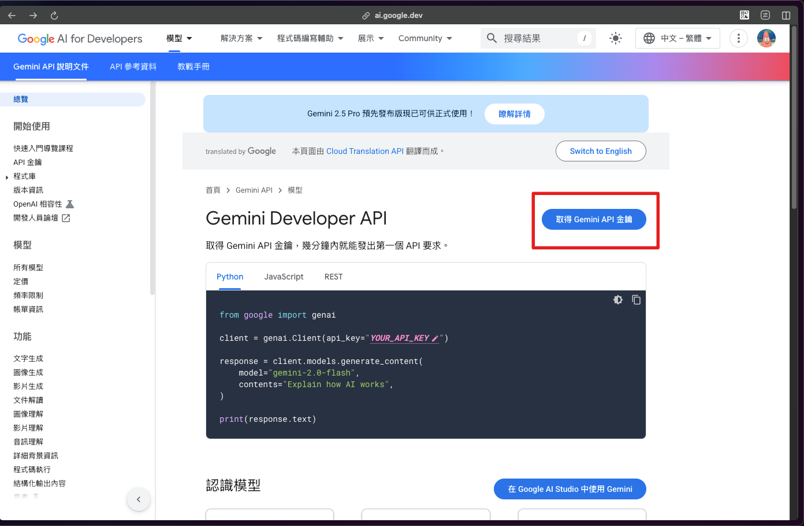
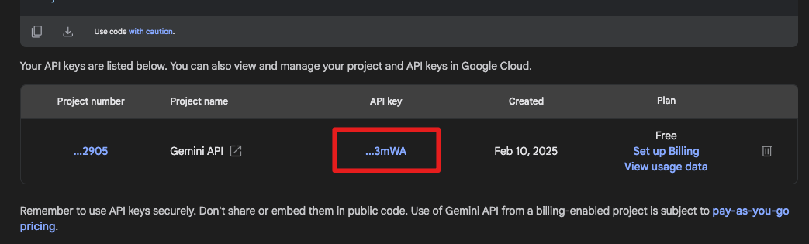

# Google 服務

## 安裝及前置作業

安裝套件包

```shell
go get -u github.com/yuyuancha/tool-package/google
```

在資料夾建立所需 `.env`。

```
GOOGLE_GEMINI_API_KEY = {Gemini api token}
```

### token 取得方式

於 Google gemini 官方 API 文檔中，登入後點選「取得 Gemini API 金鑰」。



點擊進入後即可找到你的 api token。



## 功能

-   `Gemini`: 透過 `Google` 提供的 AI 接口實作人工智慧功能。

## Gemini

### 使用方法

以文字取得文字回應的方法。

```go
g := google.NewGemini()
r, e := g.RequestTextByText("請回答我 100/20 是多少")
if e != nil {
	log.Fatalln(e)
}
fmt.Println(r)
```

output:

```
100/20 = 5
```
